<div align="center">
  
</div>

<p align="center">
  <a href="https://linkedin.com/in/oguz-akankan"><kbd> &nbsp;💼 LinkedIn&nbsp; </kbd></a>&nbsp;&nbsp;
  <a href="mailto:akankan.me@gmail.com"><kbd> &nbsp;✉️ E-Mail&nbsp; </kbd></a>&nbsp;&nbsp;
  <a href="https://codepen.io/oguzA"><kbd> &nbsp;🖊️ CodePen&nbsp; </kbd></a>
</p>

<br/>

### <samp>~$ cat about.txt</samp>

10+ years of building for the web: pixel-perfect interfaces, design systems and products that feel simple, fast and a little delightful. Frontend is home base, and right now I am wiring up the other half of the stack (Node, SQL, architecture) to ship complete products end to end.

<br/>

### <samp>~$ ps aux | grep side_projects</samp>

```text
PID    CPU%   PROJECT          STATUS
1337   99.9   ██████████       stealth  ·  something is cooking
????   ??.?   [redacted]       hidden   ·  ps: access denied
```

<sub><samp>nice try · ships when it ships</samp></sub>

<br/>

### <samp>~$ top -o skill</samp>

<div align="center">
  
</div>

<br/>

### <samp>~$ tail -f github.log</samp>

<details>
  <summary><samp>&nbsp;▸ stream live stats</samp></summary>
  <br/>
  <div align="center">
    
    
    <br/><br/>
    
  </div>
</details>

<!--
  Yılan animasyonunu aktifleştirmek istersen:
  1. .github/workflows/snake.yml dosyasını da repoya ekle
  2. Repo > Actions sekmesinden "generate snake" workflow'unu bir kez elle çalıştır (Run workflow)
  3. Aşağıdaki bloğun yorumunu kaldır

<br/>

### <samp>~$ ./snake eat_contributions</samp>

<div align="center">
  
</div>
-->

<br/>

<div align="center">
  
</div>
